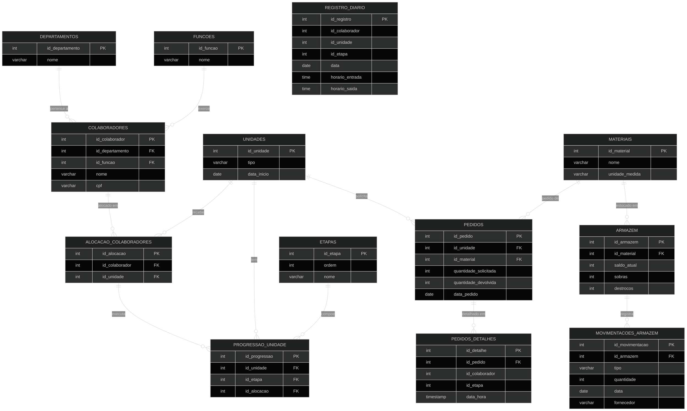

```mermaid
---
config:
  fontSize: 28
  er:
    diagramPadding: 60
    useMaxWidth: false
  theme: dark
  look: classic
---
erDiagram
  DEPARTAMENTOS {
    int id_departamento PK
    varchar nome
  }
  FUNCOES {
    int id_funcao PK
    varchar nome
  }
  COLABORADORES {
    int id_colaborador PK
    int id_departamento FK
    int id_funcao FK
    varchar nome
    varchar cpf
  }
  UNIDADES {
    int id_unidade PK
    varchar tipo
    date data_inicio
  }
  ETAPAS {
    int id_etapa PK
    int ordem
    varchar nome
  }
  ALOCACAO_COLABORADORES {
    int id_alocacao PK
    int id_colaborador FK
    int id_unidade FK
  }
  PROGRESSAO_UNIDADE {
    int id_progressao PK
    int id_unidade FK
    int id_etapa FK
    int id_alocacao FK
  }
  REGISTRO_DIARIO {
    int id_registro PK
    int id_colaborador
    int id_unidade
    int id_etapa
    date data
    time horario_entrada
    time horario_saida
  }
  MATERIAIS {
    int id_material PK
    varchar nome
    varchar unidade_medida
  }
  ARMAZEM {
    int id_armazem PK
    int id_material FK
    int saldo_atual
    int sobras
    int destrocos
  }
  MOVIMENTACOES_ARMAZEM {
    int id_movimentacao PK
    int id_armazem FK
    varchar tipo
    int quantidade
    date data
    varchar fornecedor
  }
  PEDIDOS {
    int id_pedido PK
    int id_unidade FK
    int id_material FK
    int quantidade_solicitada
    int quantidade_devolvida
    date data_pedido
  }
  PEDIDOS_DETALHES {
    int id_detalhe PK
    int id_pedido FK
    int id_colaborador
    int id_etapa
    timestamp data_hora
  }

  DEPARTAMENTOS ||--o{ COLABORADORES : "pertence a"
  FUNCOES ||--o{ COLABORADORES : "exerce"
  COLABORADORES ||--o{ ALOCACAO_COLABORADORES : "alocado em"
  UNIDADES ||--o{ ALOCACAO_COLABORADORES : "recebe"
  ALOCACAO_COLABORADORES ||--o{ PROGRESSAO_UNIDADE : "executa"
  UNIDADES ||--o{ PROGRESSAO_UNIDADE : "tem"
  ETAPAS ||--o{ PROGRESSAO_UNIDADE : "compoe"
  MATERIAIS ||--o{ ARMAZEM : "estocado em"
  ARMAZEM ||--o{ MOVIMENTACOES_ARMAZEM : "registra"
  UNIDADES ||--o{ PEDIDOS : "solicita"
  MATERIAIS ||--o{ PEDIDOS : "pedido de"
  PEDIDOS ||--o{ PEDIDOS_DETALHES : "detalhado em"
```